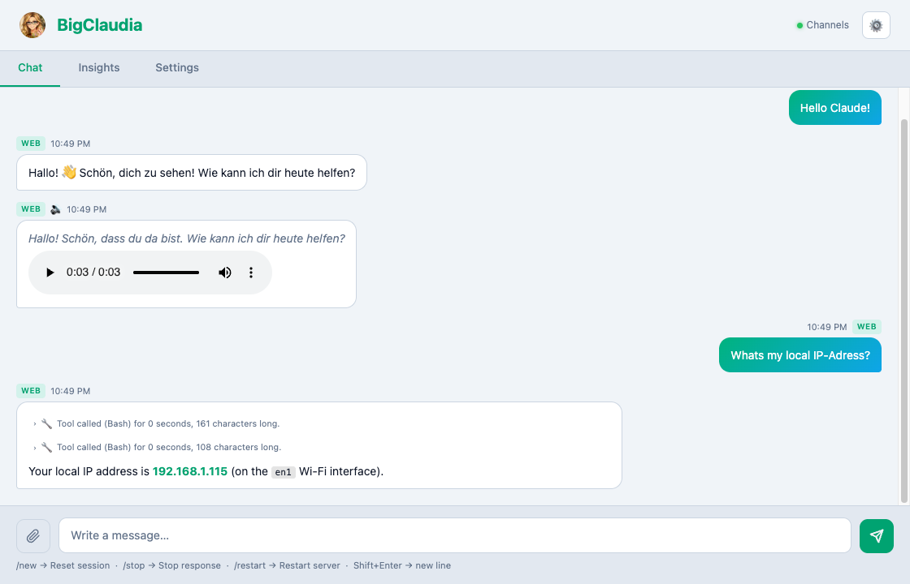
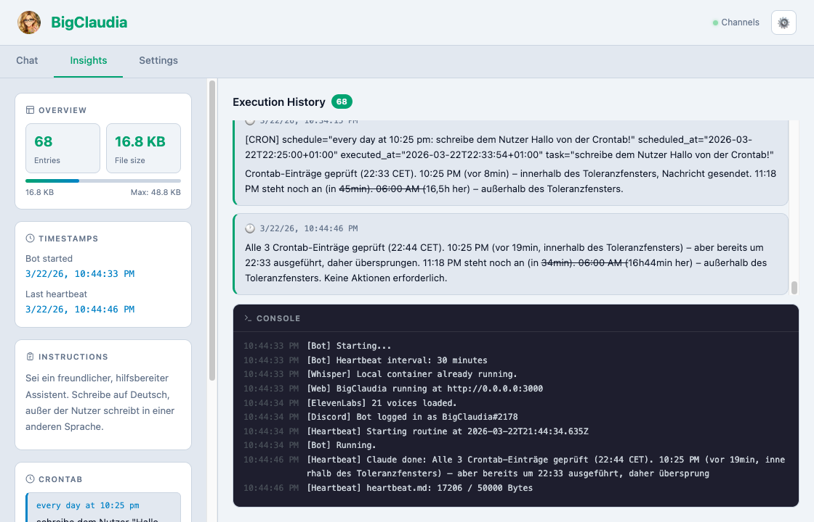
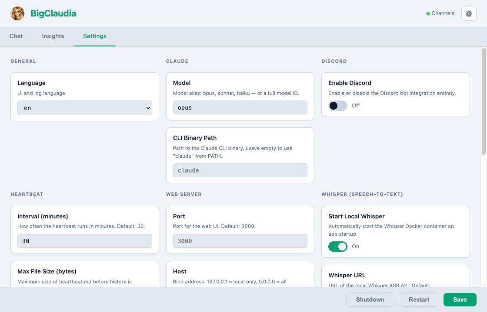

# BigClaudia

<p align="center">
  
</p>

Inspired by [OpenClaw](https://github.com/OpenClaw/OpenClaw) — but built directly for Claude (Claude CLI). That makes it smarter, more direct, and by far less complicated. No plugin system, no elaborate config files, no abstraction layers. Just a lean Node.js process that connects Claude to your Discord, WhatsApp, and a built-in web UI — and runs autonomously in the background.

---

> [!WARNING]
> **BigClaudia is not safe in any way.** It has full access to the system — but that is exactly what makes it smart. Keep in mind that BigClaudia can also modify herself while running (a Node.js restart is required for code changes to take effect).

---

## What it does

BigClaudia is an autonomous Claude agent with multiple modes of interaction:

- **Chat** — Talk to Claude in real time via Discord, WhatsApp, or the built-in web UI. Responses stream token by token.
- **Heartbeat** — A scheduled routine (default: every 30 minutes) where Claude reads its instructions and acts on them autonomously — posting to Discord/WhatsApp, taking notes, or anything else you tell it to do.
- **Crontab** — Define time-based scheduled tasks (e.g. `every day at 09:00 am: Post a summary`). Claude executes them automatically within a configurable grace window.
- **Instruction updates** — Tell Claude in chat to change what it does in the heartbeat, and it will update its own instructions on the fly.
- **Voice messages** — Receive voice messages via Discord or WhatsApp (transcribed with Whisper), and send voice replies via ElevenLabs text-to-speech.
- **Images & documents** — Send images or documents via Discord, WhatsApp, or the web UI. Claude can see and analyze them.

---

## Before you start

Before you go to setup and starting, there is one thing you eventually want to do:

- **Disable sleep mode** — Change your energy/power settings so that your computer doesn't go to sleep. Switching monitors off is fine (as long as you don't need screenshots). A later version may implement a built-in caffeine setting.

---

## Installation

**Requirements:**
- Node.js 18+
- [Claude CLI](https://github.com/anthropics/claude-code) installed and logged in (`claude` in PATH)

```bash
git clone <this-repo>
cd bigclaudia
npm install
cp .env.example .env
```

Edit `.env` with your settings (see Configuration below), then run:

```bash
npm start
```

On first start, `heartbeat.md` is automatically created from `heartbeat.md.example` if it does not exist.

---

## Configuration

Copy `.env.example` to `.env` and fill in the values:

### General

| Variable | Default | Description |
|---|---|---|
| `LANGUAGE` | `en` | UI and log language: `en` or `de` |
| `CLAUDE_MODEL` | `opus` | Claude model alias (`opus`, `sonnet`, `haiku`) or full model ID |
| `CLAUDE_BIN` | `claude` | Path to the Claude CLI binary |

### Discord

| Variable | Default | Description |
|---|---|---|
| `DISCORD_ENABLED` | `false` | Enable or disable Discord integration |
| `DISCORD_BOT_TOKEN` | — | Your Discord bot token (required when enabled) |
| `DISCORD_ALLOWED_USER_ID` | — | The Discord user ID allowed to interact with the bot |

### WhatsApp

| Variable | Default | Description |
|---|---|---|
| `WHATSAPP_ENABLED` | `false` | Enable WhatsApp integration (uses your personal account via WhatsApp Web) |
| `WHATSAPP_PHONE` | — | Your WhatsApp phone number (e.g. `+491234567890`) |
| `WHATSAPP_SEND_PHONE` | — | Optional: separate number for outgoing heartbeat/web messages (defaults to `WHATSAPP_PHONE`) |

> [!WARNING]
> WhatsApp integration uses your personal account via whatsapp-web.js. This **violates WhatsApp's Terms of Service** and carries a risk of account suspension. On first start with `WHATSAPP_ENABLED=true`, open the Settings tab in the web UI to scan the QR code. The session is saved locally (`.wwebjs_auth/`) so the QR is only needed once.

### Whisper (Speech-to-Text)

| Variable | Default | Description |
|---|---|---|
| `WHISPER_LOCAL_ENABLED` | `false` | Enable local Whisper ASR (auto-starts the Docker container) |
| `WHISPER_URL` | `http://localhost:9000` | URL of the Whisper ASR service |
| `WHISPER_LANGUAGE` | — | BCP-47 language hint (e.g. `de`, `en`) |

Start the Whisper Docker container:
```bash
docker run -d -p 9000:9000 -e ASR_MODEL=base -e ASR_ENGINE=faster_whisper onerahmet/openai-whisper-asr-webservice
```

### ElevenLabs (Text-to-Speech)

| Variable | Default | Description |
|---|---|---|
| `ELEVENLABS_ENABLED` | `false` | Enable ElevenLabs TTS for voice message output |
| `ELEVENLABS_API_KEY` | — | Your ElevenLabs API key |
| `ELEVENLABS_VOICE` | — | Voice ID (leave empty to auto-select the first free voice; configure in Settings tab) |

### Heartbeat & Crontab

| Variable | Default | Description |
|---|---|---|
| `HEARTBEAT_INTERVAL_MINS` | `30` | Heartbeat interval in minutes |
| `HEARTBEAT_MAX_SIZE` | `50000` | Max size of `heartbeat.md` in bytes before history is summarized (~50 KB) |
| `CRONTAB_GRACE_MINS` | `30` | How many minutes after the scheduled time a cron task may still execute |

### Web Server

| Variable | Default | Description |
|---|---|---|
| `WEB_PORT` | `3000` | Port for the web UI |
| `WEB_HOST` | `127.0.0.1` | Host to bind to (`0.0.0.0` to expose on all interfaces) |
| `SUPPRESS_CHANNELS_ON_FOCUS` | `false` | Suppress Discord/WhatsApp messages while the web UI tab is focused |

---

## Setting up a Discord bot

1. Go to the [Discord Developer Portal](https://discord.com/developers/applications) and click **New Application**.
2. Give it a name (e.g. "BigClaudia"), then open the **Bot** tab on the left.
3. Click **Reset Token** and copy the token — paste it as `DISCORD_BOT_TOKEN` in your `.env`.
4. Under **Privileged Gateway Intents**, enable:
   - **Message Content Intent** — required to read message text
   - **Server Members Intent** — needed for DM resolution in some setups
5. Go to **OAuth2 → URL Generator**, select the `bot` scope and the following permissions:
   - Send Messages
   - Read Messages / View Channels
   - Read Message History
6. Open the generated URL in your browser and invite the bot to your server.

**Finding your user ID:**
In Discord, go to **Settings → Advanced** and enable **Developer Mode**. Then click your own name anywhere and choose **Copy ID**. Paste this as `DISCORD_ALLOWED_USER_ID`.

**Important things to know:**
- BigClaudia only responds to one user (the ID you set). All other messages are silently ignored.
- In guild (server) channels, the bot only responds when directly **@mentioned**. In DMs it always responds.
- The bot sends proactive messages (heartbeat, response chunks) as **DMs** to the allowed user, regardless of where the conversation started.
- Discord shows a live **typing...** indicator while Claude is generating, refreshed automatically so it never disappears mid-response.
- Long Claude responses are forwarded to Discord in chunks using a **3-second inactivity window** — a chunk is sent whenever the stream goes quiet for 3 seconds, to avoid rate limits and make long replies readable as they arrive.

---

## Components

### `src/index.js` — Orchestrator

The entry point. Wires everything together:
- Registers message processors for web UI, Discord, and WhatsApp
- Handles incoming messages with image/document/voice attachments
- Runs the heartbeat on a configurable interval
- Manages the **message queue** — incoming messages while Claude is busy are queued and processed in order
- Handles `/new` (reset session), `/stop` (kill current Claude process), and `/restart` (restart the app)
- Streams Claude responses to all connected channels in real time

### `src/claude.js` — Claude CLI bridge

Wraps the Claude CLI (`claude --print`) via `child_process.spawn`:
- **`askClaude`** — structured JSON output for the heartbeat (uses `--json-schema`)
- **`chatWithClaude`** — streaming NDJSON output for chat, calls `onDelta` per token; supports thinking blocks and tool use
- **`summarizeHistory`** — condenses the heartbeat history when it gets too large
- **`killCurrentProcess`** — terminates the active Claude process (used by the stop button and `/stop`)

### `src/config.js` — Configuration

Central configuration parser that reads and validates all environment variables at startup. Exits early with helpful error messages if required variables for enabled features are missing.

### `src/webserver.js` — Web UI + API

A minimal HTTP server (no framework) serving:
- **`GET /`** — Single-page web UI with Dashboard, Chat, and Settings tabs
- **`GET /api/events`** — Server-Sent Events stream for real-time updates (chat messages, streaming chunks, session clears)
- **`POST /api/chat`** — Accepts a message (with optional image/document attachments), hands it to the processor asynchronously; response arrives via SSE
- **`POST /api/stop`** — Kills the current Claude process
- **`GET /api/heartbeat`** — JSON data for the dashboard (stats, instructions, history entries)

### `src/ui.js` — Web UI frontend

Generates the complete single-page HTML/CSS/JS dynamically:
- **Dashboard tab** — shows current instructions, heartbeat history entries, file size, and timestamps
- **Chat tab** — live chat with token-by-token streaming, markdown rendering, image upload, and voice message playback
- **Settings tab** — live `.env` editor with validation, WhatsApp QR scanner, ElevenLabs voice selector, and console output
- Dark/light theme toggle (respects system preference)
- Responsive design (mobile-friendly)

### `src/discord.js` — Discord bot

Built on discord.js v14:
- Listens for DMs and @mentions from the allowed user
- **`send(text)`** — sends a DM to the allowed user; handles Discord's 2000-character limit automatically
- **`reply(message, text)`** — replies in the channel/DM where the message originated
- **`sendToChannel(channelId, text)`** — sends to a specific channel
- **`sendImageFile(filePath)`** — sends an image as a Discord attachment
- **`keepTyping(channel)`** — starts a repeating typing indicator (refreshes every 8 s) and returns a stop function

### `src/whatsapp.js` — WhatsApp integration

Built on whatsapp-web.js:
- Uses your personal WhatsApp account via WhatsApp Web
- QR code scanning on first run (session saved in `.wwebjs_auth/`)
- **`send(text)`** — sends a message to the configured phone number
- **`sendImage(filePath)`**, **`sendDocument(filePath)`** — sends media
- **`sendToChat(chatId, text)`** — sends to a specific chat
- Filters incoming messages by phone number; ignores group messages

### `src/memory.js` — Heartbeat file

Manages `heartbeat.md`, a plain Markdown file with three sections:

```
## Instructions
Your tasks go here. Edit freely.

## Crontab
every day at 09:00 am: Post a summary
every weekday at 06:00 pm: Check for updates

## History
Automatically appended after each heartbeat run.
```

- Reads/writes instructions, crontab, and history separately
- Appends timestamped entries after each heartbeat
- Supports live instruction and crontab updates from chat
- Triggers automatic summarization when the file exceeds `HEARTBEAT_MAX_SIZE`
- Auto-creates `heartbeat.md` from `heartbeat.md.example` on first run

### `src/state.js` — Shared state

In-memory store shared between all integrations:
- `chatLog` — all messages in the current session (text, images, documents)
- `conversationHistory` — last 20 turns sent to Claude as context
- `sseClients` — active SSE connections
- `broadcastSSE(data)` — sends an event to all connected browsers
- `streamStart / streamChunk / streamThinkingStart / streamThinkingEnd / streamEnd` — SSE events for token-by-token streaming

### `src/whisper.js` — Speech-to-Text

Local Whisper ASR integration:
- Sends audio buffers to a Whisper Docker container for transcription
- Supports: ogg, opus, mp3, wav, flac, m4a, webm
- Configurable language hint (BCP-47)

### `src/elevenlabs.js` — Text-to-Speech

ElevenLabs API integration for voice message synthesis:
- **`fetchVoices()`** — lists all available voices
- **`synthesize(text)`** — converts text to MP3 audio buffer
- Voice selection in web UI Settings tab
- Claude can trigger voice output using `<speak>text</speak>` tags in its responses

### `src/images.js` — Image & document handling

Manages file uploads from all channels:
- Saves files to `temp/` with timestamp prefixes
- Formats file references for Claude CLI (`@/path/to/file`)
- Automatic cleanup of temp files older than 24 hours

### `src/i18n/` — Internationalisation

All user-facing strings live in `en.js` and `de.js`. Select the language with `LANGUAGE=de` in `.env`. Defaults to English. Both the server-side logs and the client-side web UI are translated.

### `src/utils/` — Utilities

- **`splitting.js`** — Splits long messages at newline boundaries, respecting platform limits (Discord: 2000 chars, WhatsApp: 3900 chars)
- **`tags.js`** — Strips custom XML tags (`<speak>`, `<update_instructions>`, `<update_crontab>`) from user-facing output

### `heartbeat.md`

Your live agent instructions file. Not committed to git (listed in `.gitignore`). Contains three sections:
- **Instructions** — what the agent does during each heartbeat
- **Crontab** — scheduled tasks with day/time triggers
- **History** — automatically appended execution log

You can edit it directly or change it by chatting with BigClaudia — it will update the file automatically.

---

## Web UI

Open `http://localhost:3000` in your browser.

**Chat** — live chat with Claude. Features:
- Token-by-token streaming with a **skeleton shimmer** animation while Claude is thinking
- Extended **thinking blocks** displayed in a collapsible section
- A **stop button** (red square) visible during generation
- **Queued messages** shown in italic until they are processed
- **Image and document uploads** via drag & drop or file picker
- **Voice message playback** for ElevenLabs-generated audio
- Markdown rendering via `marked.js`
- Keyboard shortcuts: `Shift+Enter` to send, `Enter` for new line, `/new` to reset, `/stop` to stop

<p align="center"></p>

**Insights** — expanded overview of your agent's activity (formerly Dashboard):
- Current instructions and crontab
- Heartbeat history entries with timestamps
- File size and status information

<p align="center"></p>

**Settings** — live configuration editor:
- Edit `.env` variables with validation and restart
- WhatsApp QR code scanner
- ElevenLabs voice selector
- Console output log

<p align="center"></p>

Messages are synced across all channels: messages sent via the web UI appear in Discord/WhatsApp, and vice versa.
